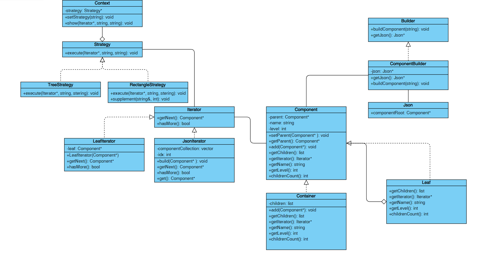

# Funny-Json-Explorer-Advanced

## 编译

可以选择直接运行`compile.bat`来一键编译，也可以在执行以下命令来编译

```batch
g++ ./src/main.cpp ./src/CommonLibrary.h ./src/Component.h ./src/Component.h ./src/Component.cpp ./src/Builder.h ./src/Builder.cpp ./src/Strategy.h ./src/Strategy.cpp ./src/Iterator.h ./src/Iterator.cpp -o ./bin/fje
```

## 运行

编译完成后，可以前往`/bin`下执行以下指令运行程序

```batch
./fje -f <json file> -s <style> -i <icon family>
```

也可以将`.../bin`添加到环境变量中执行以下指令运行程序

```batch
fje -f <json file> -s <style> -i <icon family>
```

对于本程序，可行的指令格式样例如下

```batch
fje -f test.json -s tree
fje -f test.json -s tree -i ? $
```

本程序可以缺省图标族的参数，如果不指定图标族，那么本程序的输出结果将不包含图标，如果指定图标族，请输入两个要指定的图标，格式为`中间节点图标 叶节点图标` 

## 类图



1. 组合模式
   
   使用组合模式用于将JSON数据表示为树状结构。其中实现了Component类提供基本的接口和变量，Container类和Leaf类均继承Component，Container类表示包含其他节点的节点，Leaf类表示叶子节点。

2. 建造者模式
   
   使用建造者模式根据JSON字符流构造组合模式的结构。实现Builder类提供基本接口，ComponentBuilder类继承Builder，通过构造算法并调用Component的方法构建JSON的树形结构。最后还实现了一个Json类用于存储构建结果（组合模式树的root）。

3. 迭代器模式
   
   使用迭代器模式对构造玩的JSON组合模式树进行深度优先遍历。Iterator类提供基本接口，JsonIterator表示JSON组合模式树的容器的迭代器，LeafIterator表示JSON组合模式叶子的迭代器。

4. 策略模式
   
   使用策略模式打印最后的结果，每种策略代表一种打印风格。Strategy类提供基本接口，TreeStrategy类打印树形风格，Rectangle类打印矩形风格。具体的算法是利用JSON组合模式的迭代器深度优先遍历元素，并结合元素的相关信息绘制。Context用于和客户端交互，客户端可以在Context选取策略并执行策略。

## 客户代码实现

整个程序的基本流程如下

- 读取json文件

- 使用builder构建json树形结构

- 获取组合模式迭代器

- 初始化Context选择并策略

- 与Context交互执行策略

可行的客户代码样例如下

```cpp
Builder *jsonComponent = new ComponentBuilder();  // 初始化Builder
jsonComponent->buildComponent(jsonStr);  // 使用Builder构建JSON结构
Iterator<Component> *it = jsonComponent->getJson()->componentRoot->getIterator();  // 获取迭代器
Context<Component> *funnyJsonExplorer = new Context<Component>();  // 初始化策略模式
funnyJsonExplorer->setStrategy(style);  // 选择绘制策略(风格)
funnyJsonExplorer->show(it, icon1, icon2);  // 执行策略(绘制)
```

用户调用Builder完成对json进行构造后，只需要与Context交互并选择想要的策略(打印风格)并执行即可。
